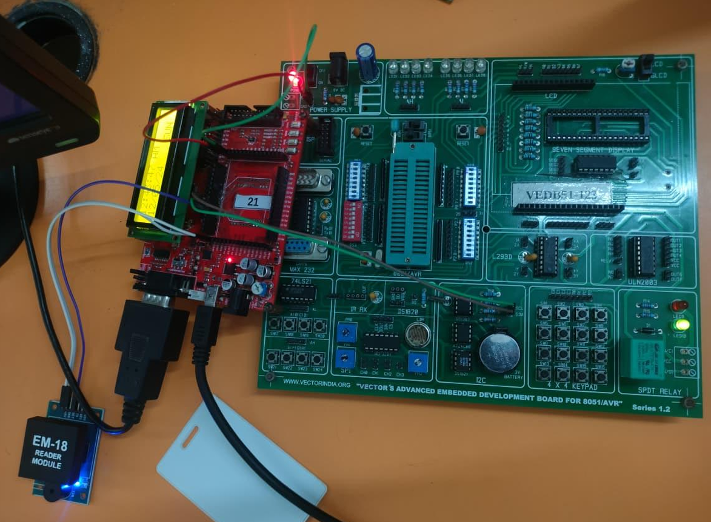

# 🔧 Hardware Setup

## Overview

The Automated RFID Attendance System consists of multiple hardware modules integrated to provide automatic employee attendance recording.

The system uses **two microcontrollers** to handle different tasks efficiently.

---

## Hardware Components

| Component | Description |
|----------|-------------|
| 8051 Microcontroller | Handles RFID card reading |
| LPC2129 Microcontroller | Main processing controller |
| EM-18 RFID Reader | Reads RFID tag IDs |
| RFID Cards | Unique employee identification cards |
| RTC Module | Provides date and time |
| 16×2 LCD Display | Displays system messages |
| Power Supply | Provides regulated voltage |

---

## 1️⃣ EM-18 RFID Reader

The **EM-18 RFID reader** detects RFID cards and reads their unique identification number.

Features:

- Contactless scanning
- 125 kHz operating frequency
- Serial communication output
- 9600 baud rate transmission

The reader sends the **12-digit tag ID** to the 8051 microcontroller.

---

## 2️⃣ 8051 Microcontroller

The **8051 microcontroller acts as the RFID reader interface controller**.

Responsibilities:

- Receive RFID data from EM-18
- Process serial data
- Forward tag ID to LPC2129 using UART communication

This microcontroller acts as an intermediate layer between the RFID reader and the main controller.

---

## 3️⃣ LPC2129 Microcontroller

The **LPC2129 ARM7 microcontroller** is the main controller of the system.

Functions include:

- Receiving RFID tag ID from 8051
- Communicating with RTC module
- Controlling LCD display
- Sending attendance records to PC

---

## 4️⃣ Real Time Clock (RTC)

The RTC module is connected to LPC2129 using the **I²C protocol**.

Functions:

- Maintains accurate date and time
- Provides timestamps for attendance records
- Uses battery backup to maintain time during power outages

---

## 5️⃣ LCD Display

A **16×2 LCD display** is used to show system messages.

Example messages:
```
Scan Your Card

Employee Verified
Attendance Marked

Invalid Card
Access Denied
```
The LCD operates in **4-bit mode** using LPC2129 GPIO pins.

---

## 6️⃣ PC Interface

A Linux PC is connected to the LPC2129 through **UART communication**.

The PC receives attendance records and stores them in a **database or text file**.

Example data:
```
Employee ID : 1034
Date : 12-04-2025
Time : 09:02 AM
```

---

## Power Supply

The system requires a **stable regulated power supply**.

Typical configuration:
```
5V regulated supply → Microcontroller
5V → RFID reader
5V → LCD display
```

---

## Hardware Implementation

Below is the real hardware implementation of the project.

<p align="center">
  
</p>

> *Actual hardware setup of Automated Employee Attendance System using RFID Technology.*
