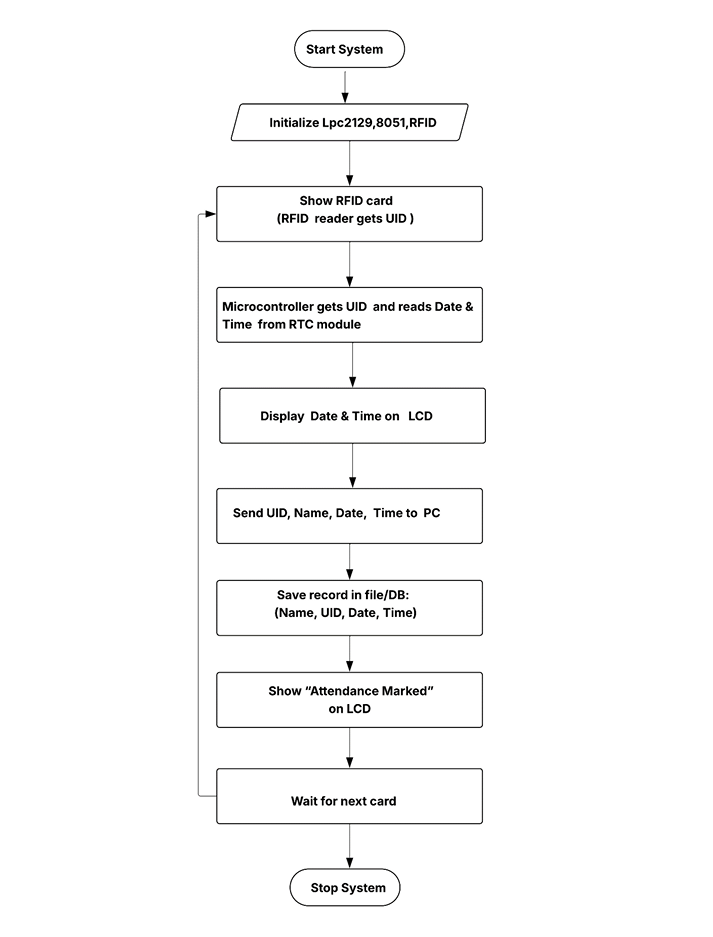

# 💻 Software Design

## Overview

The software for the **RFID Based Employee Attendance System** is developed using **Embedded C/C++** and compiled using **Keil µVision IDE**.  
The firmware runs on two microcontrollers working together to process RFID data and record attendance.

- **8051 Microcontroller** – Handles RFID card detection.
- **LPC2129 Microcontroller** – Processes attendance data, retrieves time from RTC, controls LCD, and sends records to the PC.

The software architecture ensures reliable communication between hardware components and the Linux-based attendance logging system.

---

# 1️⃣ Software Requirements

## Embedded C / C++

**Purpose:**  
Programming language used for developing firmware for both microcontrollers.

**Reason for Use:**

- Provides low-level hardware access
- Efficient memory usage
- Fast execution for embedded systems

**Role in the Project**

- Reading RFID card data
- Communicating with the RTC module
- Controlling the LCD display
- Sending attendance data to the PC

---

## Keil µVision IDE

**Function:**  
Integrated Development Environment used for writing, compiling, and debugging embedded programs.

**Features**

- Embedded project management
- Code debugging tools
- Support for ARM7 microcontrollers such as LPC2129
- Generation of HEX files for flashing

---

## Flash Magic

**Function:**  
Used to upload compiled firmware into the microcontroller flash memory.

**Role in the Project**

1. Connect microcontroller to PC via serial port
2. Load compiled HEX file
3. Program firmware into LPC2129

---

## Linux Operating System

**Function:**  
Provides the environment for running the serial communication program that receives attendance data.

**Advantages**

- Open-source platform
- Stable serial communication
- Easy data logging

---

## GCC Compiler

**Function:**  
Compiles C/C++ programs on the Linux system.

**Usage in the Project**

Used to compile the serial communication program:
```
gcc serial.c
./a.out
```

The program reads attendance data transmitted from the microcontroller.

---

## Terminal Emulator

**Function:**  
Used for monitoring serial communication between the microcontroller and PC.

**Role**

- Debugging UART communication
- Verifying attendance data transmission

Examples include:

- Minicom
- GTKTerm
- Serial Monitor

---

# 2️⃣ Software Architecture

The system firmware is divided into two main parts.
```
RFID Card
↓
EM-18 RFID Reader
↓
8051 Microcontroller
↓ (UART)
LPC2129 Microcontroller
↓
RTC (I2C) + LCD (GPIO) + Linux PC (UART)
```

### Responsibilities

| Controller | Responsibility |
|-------------|---------------|
| 8051 | Reads RFID tag ID |
| LPC2129 | Processes attendance data |
| Linux PC | Stores attendance logs |

---

# 3️⃣ RFID Reader Module (8051)

The **8051 firmware** handles communication with the EM-18 RFID reader.

### Tasks

- Receive serial data from EM-18 RFID reader
- Extract RFID tag ID
- Send tag ID to LPC2129 via UART

### Logic
```
Wait for RFID card
Receive tag ID
Transmit ID to LPC2129
Repeat
```

---

# 4️⃣ LPC2129 Processing Module

The LPC2129 microcontroller performs the main system operations.

### Tasks

- Receive RFID tag ID from 8051
- Verify tag data
- Retrieve time from RTC module
- Display messages on LCD
- Send attendance record to PC

---

# 5️⃣ RTC Communication Module

The LPC2129 communicates with the **Real Time Clock (RTC)** using the **I²C protocol**.

### Data Retrieved

- Current Date
- Current Time

This allows the system to generate **timestamped attendance records**.

---

# 6️⃣ LCD Display Module

A **16×2 LCD display** provides system status information.

### Typical Messages
```
SCAN YOUR ID
Attendance Recorded
Invalid Card
```

### LCD Configuration

- 4-bit communication mode
- Controlled through LPC2129 GPIO pins

---

# 7️⃣ Attendance Logging Module

Once a valid RFID card is detected:

1. RFID ID is received by LPC2129
2. Current time is fetched from RTC
3. Attendance record is created
4. Data is transmitted to the Linux terminal

### Example Output
```
4900C8E53F5B employee1
IN TIME Mon Apr 12 09:02:55 2025

4900C8E53F5B employee1
OUT TIME Mon Apr 12 09:05:36 2025
```

---

# 8️⃣ Serial Communication Program (Linux)

A C program running on the Linux PC receives attendance records from the microcontroller.

### Execution
```
gcc serial.c
./a.out
```

### Functions

- Reads UART serial data
- Displays attendance logs
- Stores records for future analysis

---

# 9️⃣ Simulation

Before hardware implementation, the system was tested using **Proteus simulation**.

### Simulation verifies:

- Microcontroller logic
- Serial communication
- LCD display output
- Data transmission

Simulation files are included in the repository.

---

# 🔄 Software Flow
```
Start
↓
Initialize System
↓
Wait for RFID Card
↓
8051 Reads RFID Tag
↓
Send Tag to LPC2129
↓
LPC2129 Reads Time from RTC
↓
Display Result on LCD
↓
Send Attendance Data to PC
↓
Repeat
```

---

<p align="center">
  
</p>

> *Actual flow of the Automated Employee Attendance System using RFID Technology.*
---

# Simulation

Before hardware implementation, the system was tested using **Proteus simulation**.

Simulation verifies:

- Serial communication
- LCD display output
- Microcontroller logic

<p align="center">
  
</p>
