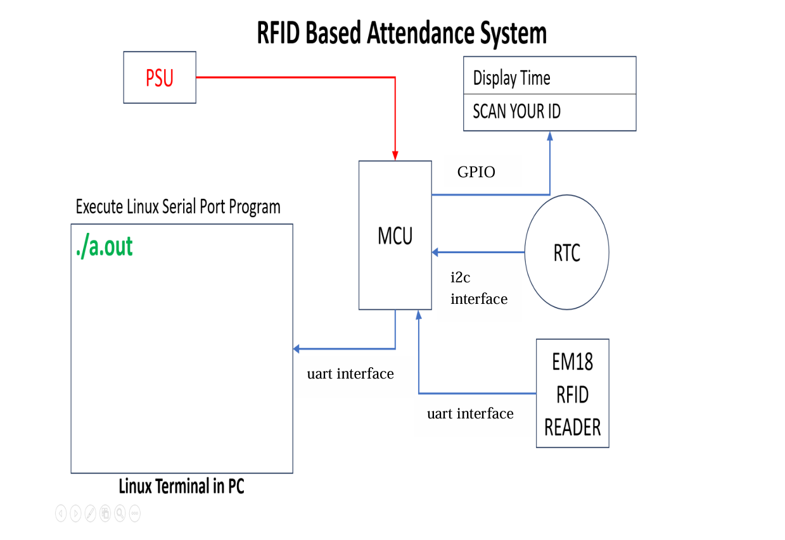

# System Architecture

The Automated Employee Attendance System uses RFID technology to record employee attendance automatically. The system integrates embedded hardware, firmware, and a Linux-based application for attendance logging.

---

## System Components

| Component | Description |
|----------|-------------|
| EM-18 RFID Reader | Reads unique RFID card IDs |
| 8051 Microcontroller | Processes RFID data |
| LPC2129 Controller | Handles communication with Linux system |
| RTC Module | Provides accurate timestamp |
| 16×2 LCD Display | Displays attendance status |
| Buzzer | Provides audio feedback |
| Linux System | Stores attendance records |

---

## Architecture Flow

RFID Card  
↓  
RFID Reader (EM-18)  
↓  
8051 Microcontroller  
↓  
ID Verification  
↓  
RTC Timestamp  
↓  
LCD Display Confirmation  
↓  
Linux System Logging

---

## Block Diagram

---

## Key Features

- Contactless attendance recording
- Automatic timestamp generation
- Real-time user feedback
- Reliable data logging
