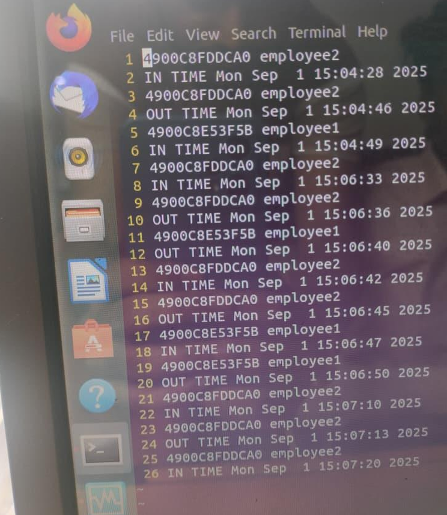

# ⚙ Working Principle

## Overview

The Automated RFID Attendance System records employee attendance automatically using RFID identification and embedded system processing.

The system combines **RFID technology, microcontroller control, and serial communication** to create an efficient attendance tracking mechanism.

---

# Step-by-Step System Operation

## 1️⃣ System Initialization

When the system powers ON:

- 8051 microcontroller initializes RFID reader interface
- LPC2129 initializes RTC, LCD, and UART communication
- LCD displays the message:
```
SCAN YOUR ID
```

---

## 2️⃣ RFID Card Scanning

The employee brings their RFID card close to the **EM-18 reader**.

The reader:

- Detects the RFID tag
- Reads the **12-digit unique ID**
- Sends the ID to the **8051 microcontroller**

---

## 3️⃣ RFID Data Forwarding

The **8051 microcontroller receives the RFID tag ID** through UART communication.

The 8051 then forwards this ID to the **LPC2129 microcontroller**.

---

## 4️⃣ Time and Date Retrieval

Once LPC2129 receives the RFID ID:

- It communicates with the **RTC module via I²C**
- Retrieves the current **date and time**

Example timestamp:
```
09:02:49 AM
12/04/2025
MON
```

---

## 5️⃣ Data Processing

The LPC2129 processes the attendance data by:

- Associating the RFID ID with the timestamp
- Checking for duplicate entries
- Verifying valid employee IDs

---

## 6️⃣ Attendance Confirmation

**If the card is valid:**
```
Attendance Recorded
```

**If the card is invalid:**
```
Invalid Card
```

### The message is displayed on the LCD.

---

## 7️⃣ Data Transmission and Storage

The LPC2129 sends the attendance record to a **Linux PC terminal via UART**.

Example transmitted record:
```
4900C8FDDCA0 employee2
IN TIME Mon Apr 12 09:02:49 2025

4900C8FDDCA0 employee2
OUT TIME Mon Apr 12 09:04:36 2025
```

The PC stores this information in a **database or log file**.

---

## 8️⃣ System Reset

After recording attendance, the system resets and waits for the next card scan.

LCD message returns to:
```
SCAN YOUR ID
```

---

## OUTPUT EXAMPLE:

Below is the real time output.

<p align="center">
  
</p>

> *Actual real time output of Automated Employee Attendance System using RFID Technology.*
